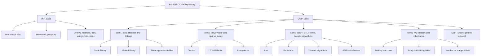
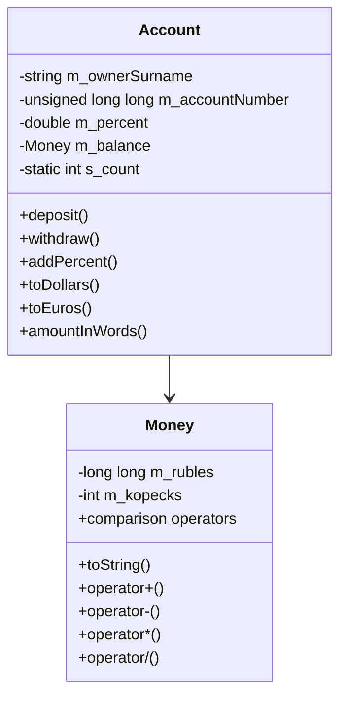
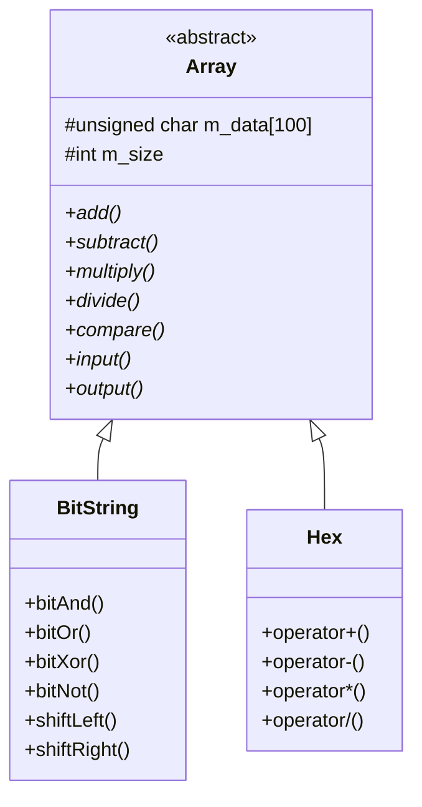
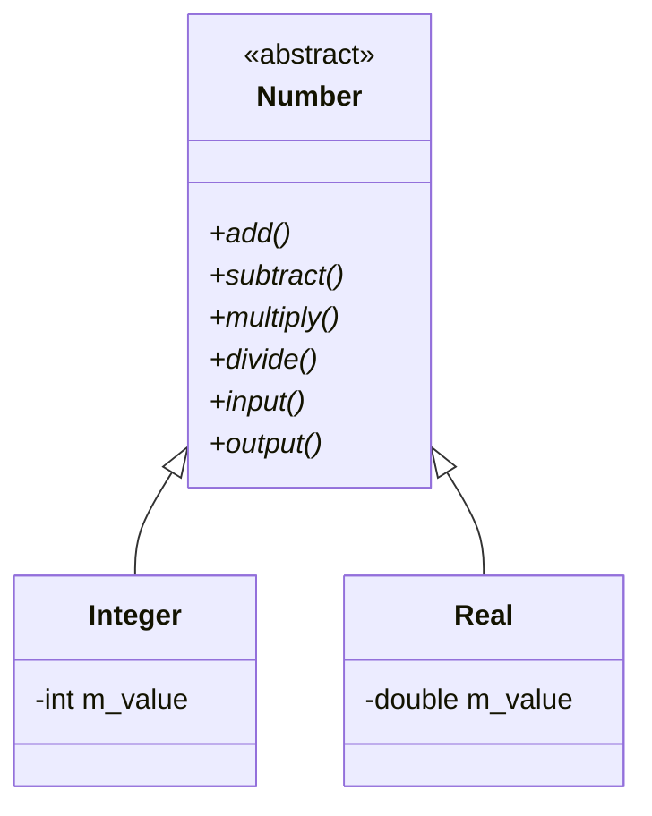
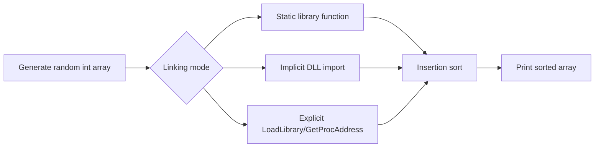
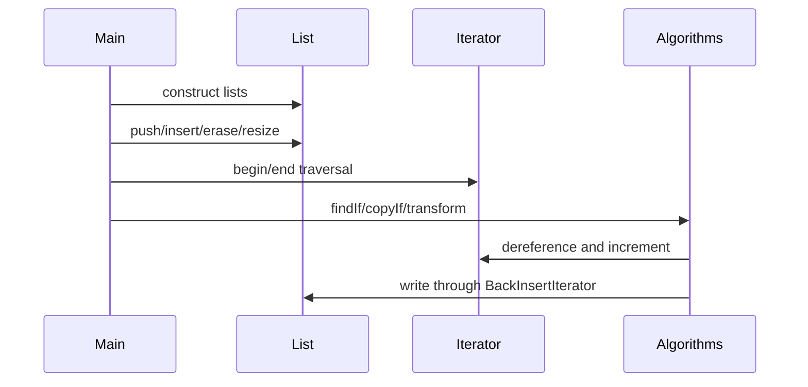
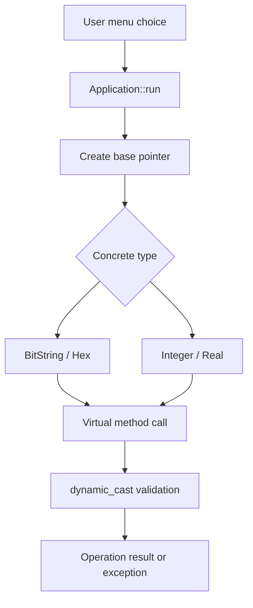

# BMSTU C/C++ Coursework Portfolio

> A portfolio-grade collection of first-year C and C++ coursework: procedural algorithms, file processing, manual memory management, static and dynamic libraries, object-oriented class design, inheritance, polymorphism, sparse matrices, STL-like containers, iterators, and generic algorithms.

---

## Table of Contents

- [Executive Summary](#executive-summary)
- [Engineering Highlights](#engineering-highlights)
- [Technology Stack](#technology-stack)
- [Repository Architecture](#repository-architecture)
- [Directory Structure](#directory-structure)
- [Core Projects](#core-projects)
- [Data Models](#data-models)
- [Application Flow](#application-flow)
- [Implemented Feature Map](#implemented-feature-map)
- [Engineering Decisions](#engineering-decisions)
- [Build and Verification Status](#build-and-verification-status)
- [Code Quality Assessment](#code-quality-assessment)
- [Scalability and Performance](#scalability-and-performance)
- [Security and Safety Considerations](#security-and-safety-considerations)
- [Future Improvements](#future-improvements)
- [Portfolio Summary](#portfolio-summary)

---

## Executive Summary

This repository is a structured BMSTU C/C++ coursework archive. It combines early procedural programming assignments with more advanced C++ projects that demonstrate build-system organization, library linkage, custom containers, operator overloading, inheritance, polymorphism, exception handling, and generic algorithms.

The repository is not a single production application. It is a collection of independent console projects and laboratory tasks. Its engineering value comes from showing progression across several important systems-programming topics:

- C-style algorithms, arrays, strings, files, lists, trees, and manual allocation.
- C++ object modeling with encapsulated classes and overloaded operators.
- Static and dynamic library creation with CMake.
- Explicit runtime DLL loading through the Windows API.
- Sparse matrix/vector abstractions.
- Abstract base classes and virtual dispatch.
- Type-safe downcasting through `dynamic_cast`.
- STL-inspired containers, iterators, output iterators, and algorithms.

The strongest parts of the repository are now `sem1_lab1`, `sem1_lab34`, and `sem1_hw`, because they show architectural separation, reusable abstractions, and deliberate use of C++ language mechanisms rather than only standalone procedural exercises.

---

## Engineering Highlights

- **CMake-based multi-target project** for static and shared libraries in `sem1_lab1`.
- **Three linkage strategies**: static linking, implicit dynamic linking, and explicit DLL loading via `LoadLibraryA` / `GetProcAddress`.
- **Custom sparse matrix/vector algebra** with checked dimensions, stream operators, and CSLR-like compressed storage.
- **Menu-driven OOP applications** with dedicated `Application` classes.
- **Money/account domain model** with normalized ruble/kopeck arithmetic, account operations, currency conversion, and object counting.
- **Inheritance hierarchy for arrays** through abstract `Array`, concrete `BitString`, and concrete `Hex`.
- **Numeric polymorphism** through abstract `Number`, concrete `Integer`, and concrete `Real`.
- **Safe runtime type checks** using `dynamic_cast` before operating on derived objects through base pointers.
- **Custom STL-like doubly linked list** with copy/move semantics, iterator support, initializer-list construction, range construction, insert/erase, resize, and exception handling.
- **Generic algorithms** inspired by the STL: `findIf`, `minElement`, `maxElement`, `forEach`, `copyIf`, and `transform`.
- **Back insert iterator adapter** that enables output-iterator style writes into the custom list.

---

## Technology Stack

| Area | Technology / Approach |
|---|---|
| Languages | C, C++ |
| C++ standard used in checks | C++17 for most OOP projects, C++2b in the exam task |
| Build tooling | CMake in `sem1_lab1`; local `g++` commands elsewhere |
| Libraries | Static library, shared library / DLL |
| Windows API | `LoadLibraryA`, `GetProcAddress`, `FreeLibrary` |
| OOP mechanisms | Classes, constructors, destructors, copy/move semantics, virtual methods, abstract base classes |
| Generic programming | Function templates, class templates, iterator ranges, SFINAE with `enable_if` |
| Error handling | `std::exception`, custom exceptions, `std::invalid_argument`, `std::out_of_range`, console validation |
| Storage models | Raw arrays, dynamic arrays, linked nodes, compressed sparse matrix arrays, text/binary files |
| Testing approach | Console demonstrations and manual compile/link checks |
| Database/API/Deployment | Not present |

---

## Repository Architecture



### Architectural Style

| Project area | Style |
|---|---|
| `INF_Labs` | Independent procedural console programs |
| `sem1_lab1` | Multi-target CMake project with libraries and apps |
| `sem1_lab2` | Object-oriented mathematical types |
| `sem1_lab34` | Header-only template library plus console test harness |
| `sem1_hw` | Three independent menu-driven OOP applications |
| `OOP_Exam` | Small generic algorithm demonstration |

---

## Directory Structure

```text
BMSTU/
├── README.md
├── .gitignore
├── 1_course/
│   ├── INF_Labs/
│   │   ├── Laboratory_2.cpp ... Laboratory_18.cpp
│   │   ├── HW_1.cpp ... HW_5.cpp
│   │   └── RK_4.cpp
│   └── OOP_Labs/
│       ├── sem1_lab1/
│       │   └── LR_1_Avilov_FN_11_24B/
│       │       ├── CMakeLists.txt
│       │       ├── staticLib/
│       │       ├── dynamicLib/
│       │       └── app/
│       ├── sem1_lab2/
│       │   ├── Vector.h / Vector.cpp
│       │   ├── Matrix.h / Matrix.cpp
│       │   ├── ProxyVector.h / ProxyVector.cpp
│       │   ├── Exceptions.h / Exceptions.cpp
│       │   └── Main.cpp
│       ├── sem1_lab34/
│       │   └── sem1_lab34/
│       │       ├── Container.h
│       │       ├── Iterator.h
│       │       ├── Algorithm.h
│       │       ├── Exceptions.h
│       │       └── Main.cpp
│       ├── sem1_hw/
│       │   ├── Part1_AccountMoney/
│       │   ├── Part2_BitStringHex/
│       │   └── Part3_Number/
│       └── OOP_Exam/
│           ├── ReplaceIf.h
│           ├── RecordPredicate.h / RecordPredicate.cpp
│           └── main.cpp
└── _git_backups_before_cleanup/
```

> **Repository hygiene note:** compiled `.exe` files are present in some folders. They are build artifacts and should normally be excluded from source control.

---

## Core Projects

## `sem1_lab1`: Static and Dynamic Libraries

This project demonstrates library creation and linking strategies using a shared sorting function.

### Components

| Component | Responsibility |
|---|---|
| `staticLib` | Builds `sort_static` as a static library |
| `dynamicLib` | Builds `sort_dynamic` as a shared library / DLL |
| `app_static` | Links against the static library |
| `app_implicit` | Links against the dynamic library through normal linker resolution |
| `app_explicit` | Loads the DLL manually at runtime through Windows API calls |

### Implemented Algorithm

Both libraries expose insertion sort for integer arrays:

```cpp
void insertion_sort_static(int* arr, int size);
extern "C" SORT_DYNAMIC_API void insertion_sort_dynamic(int* arr, int size);
```

### Engineering Significance

This lab is valuable because it moves beyond single-file console programs into real build composition:

- public headers,
- library targets,
- executable targets,
- exported symbols,
- preprocessor-controlled DLL import/export,
- post-build DLL copy rules,
- explicit runtime symbol lookup.

---

## `sem1_lab2`: Vector and Sparse Matrix Algebra

This project implements mathematical types with manual memory ownership and overloaded operators.

### `Vector`

`Vector` is a custom dynamically allocated array of `double`.

Key responsibilities:

- owns `double* m_data`,
- tracks `std::size_t m_size`,
- implements construction, copy construction, destruction, and assignment,
- checks index bounds,
- calculates Euclidean length,
- supports vector addition, subtraction, scalar multiplication, dot product, and stream I/O.

### `CSLRMatrix`

`CSLRMatrix` stores a sparse square matrix using a compressed profile representation:

| Field | Meaning |
|---|---|
| `m_di` | diagonal values |
| `m_al` | lower-profile values |
| `m_au` | upper-profile values |
| `m_iptr` | profile row offsets |
| `m_jptr` | column indices below the diagonal |
| `m_size` | matrix dimension |
| `m_profileSize` | stored off-diagonal profile size |

The implementation validates structural invariants such as nondecreasing `iptr`, valid `jptr` values, and strictly increasing column indices within each profile row.

### `ProxyVector`

`ProxyVector` is a non-owning view over every `step`-th element of a `Vector`. It validates nonzero step size and throws exceptions for invalid proxy indexes.

### Known Build Issue

`CSLRMatrix` declares a copy constructor and destructor, but the corresponding definitions are missing. As a result, the lab passes syntax checking but fails during linking when matrix copies or destruction are required.

---

## `sem1_lab34`: STL-Like Container, Iterator, and Algorithms

This is the most advanced generic-programming part of the repository. It implements a custom linked-list container and algorithms that work over iterator ranges.

### `List<T>`

`List<T>` is a custom doubly linked list.

Implemented capabilities include:

- default construction,
- count construction,
- count/value construction,
- range construction,
- initializer-list construction,
- copy construction,
- move construction,
- copy assignment,
- move assignment,
- `pushBack`,
- `pushFront`,
- `popBack`,
- `popFront`,
- iterator-based `insert`,
- range `insert`,
- iterator-based `erase`,
- `resize`,
- `clear`,
- `empty`,
- `size`.

### `ListIterator<T>`

The iterator supports pointer-like behavior:

- prefix/postfix `++`,
- prefix/postfix `--`,
- dereference with `*`,
- member access with `->`,
- equality/inequality comparison,
- explicit conversion to element pointer.

The iterator stores an owner pointer, allowing the container to reject insert/erase operations with iterators from another list.

### `BackInsertIterator`

The repository implements an output iterator adapter similar in spirit to `std::back_insert_iterator`. Assigning into the adapter calls `pushBack` on the destination container.

### Generic Algorithms

`Algorithm.h` provides:

| Algorithm | Purpose |
|---|---|
| `findIf` | find first element matching a predicate |
| `minElement` | find minimum element in a range |
| `maxElement` | find maximum element in a range |
| `forEach` | apply a callable to each element |
| `copyIf` | copy matching elements into an output range |
| `transform` | map input values into an output range |

### Demonstrated Domain Type

`Main.cpp` uses a `Goods` structure with fields such as ID, name, manufacturer, warehouse address, and weight. This is used to demonstrate predicates, transformation, copying, and custom type support inside `List<T>`.

---

## `sem1_hw`: Classes and Inheritance

`sem1_hw` contains three independent menu-driven OOP applications. Each part has an `Application` class that owns menu flow and demonstration scenarios.

### Part 1: `AccountMoney`

Domain model:



Key features:

- normalized ruble/kopeck representation,
- arithmetic and comparison operators for `Money`,
- stream input/output,
- account owner changes,
- deposit and withdrawal validation,
- percent accrual,
- conversion to dollars and euros by supplied rates,
- account object counting through a static field.

### Part 2: `BitStringHex`

Inheritance model:



Key features:

- abstract base class with virtual arithmetic and I/O methods,
- virtual destructor for correct deletion through `Array*`,
- `BitString` operations: AND, OR, XOR, NOT, left shift, right shift,
- `Hex` arithmetic: addition, subtraction, multiplication, division,
- fixed maximum size of 100 elements,
- runtime type checks with `dynamic_cast`,
- overflow and invalid-input handling.

### Part 3: `Number`

Inheritance model:



Key features:

- abstract numeric base class,
- virtual arithmetic interface,
- integer and real implementations,
- mixed arithmetic between `Integer` and `Real`,
- division-by-zero checks,
- polymorphic calls through `Number*`,
- explicit runtime type checks through `dynamic_cast`.

---

## `OOP_Exam`: Generic `replaceIf`

The exam task implements a small STL-style replacement algorithm:

```cpp
template<typename Iter, typename UnaryPredicate, typename NewValue>
void replaceIf(Iter iterBeg, Iter iterEnd, UnaryPredicate predicate, const NewValue& newValue)
{
    for (; iterBeg != iterEnd; ++iterBeg) {
        if (predicate(*iterBeg)) {
            *iterBeg = newValue;
        }
    }
}
```

It is demonstrated with:

- tuple-based records,
- lambda predicates,
- a stateful functor predicate,
- iterator ranges using `std::begin` and `std::end`.

The current source contains an unreachable `a++` after a `return` inside a lambda. Because the captured variable is `const`, the compiler still rejects the increment even though it is unreachable.

---

## `INF_Labs`: Procedural Programming Foundations

The `INF_Labs` folder contains standalone C/C++ exercises focused on lower-level programming fundamentals.

| Topic | Examples in repository |
|---|---|
| Numeric methods | series calculation, integration, floating-point error analysis |
| Arrays | sorting, filtering, duplicate removal, vector operations |
| Matrices | static and dynamic matrix transformations |
| Strings | tokenization, word counting, character classification |
| Files | text files, binary files, binary record manipulation |
| Data structures | linked lists, binary trees, expression trees |
| Sorting | bubble sort, quick sort, insertion sort |
| Memory management | `new/delete`, `malloc/free`, manual cleanup |

Several homework files contain multiple independent programs in one `.cpp`, including multiple `main` functions. They are useful as coursework artifacts, but they are not directly buildable as single translation units without splitting or selecting one task.

---

## Data Models

### Sparse Matrix

```text
CSLRMatrix
├── m_size
├── m_profileSize
├── m_di[m_size]
├── m_al[m_profileSize]
├── m_au[m_profileSize]
├── m_iptr[m_size + 1]
└── m_jptr[m_profileSize]
```

### Custom List

```text
List<T>
├── m_head -> ListNode<T>
├── m_tail -> ListNode<T>
└── m_size

ListNode<T>
├── m_data
├── m_prev
└── m_next
```

### Account Domain

```text
Account
├── owner surname
├── account number
├── percent
└── Money balance

Money
├── rubles
└── kopecks
```

### Polymorphic Numeric Domain

```text
Number*
├── Integer
└── Real
```

### Polymorphic Array Domain

```text
Array*
├── BitString
└── Hex
```

---

## Application Flow

### Static and Dynamic Library Flow



### STL-Like Container Flow



### Polymorphic Application Flow



---

## Implemented Feature Map

| Project | Implemented features |
|---|---|
| `sem1_lab1` | static library, shared library, insertion sort, static linking, implicit dynamic linking, explicit DLL loading |
| `sem1_lab2` | vector algebra, sparse matrix storage, matrix-vector multiplication, custom exceptions, proxy vector view |
| `sem1_lab34` | custom `List<T>`, iterators, move semantics, range operations, custom algorithms, back-insert adapter |
| `sem1_hw/Part1` | `Money`, `Account`, arithmetic, comparisons, deposits, withdrawals, interest, conversions, object counter |
| `sem1_hw/Part2` | abstract `Array`, `BitString`, `Hex`, virtual arithmetic, bitwise operations, hex arithmetic |
| `sem1_hw/Part3` | abstract `Number`, `Integer`, `Real`, virtual mixed arithmetic, division checks |
| `OOP_Exam` | generic `replaceIf`, tuple records, lambda predicate, functor predicate |
| `INF_Labs` | procedural algorithms, files, strings, lists, trees, matrices, sorting, numeric methods |

---

## Engineering Decisions

### Separate Library Targets

`sem1_lab1` uses separate static and shared library targets instead of duplicating sorting code directly inside each executable. That demonstrates an important boundary: reusable algorithm implementation is separated from application entry points.

### Export Macro for Dynamic Library Symbols

`sort_dynamic.h` uses `SORT_DYNAMIC_API` to switch between `__declspec(dllexport)` and `__declspec(dllimport)`. This is the correct Windows pattern for building and consuming DLL symbols from the same public header.

### Explicit Runtime Linking

`main_explicit.cpp` demonstrates manual DLL loading with:

```cpp
HMODULE dll = LoadLibraryA("libsort_dynamic.dll");
GetProcAddress(dll, "insertion_sort_dynamic");
FreeLibrary(dll);
```

This is useful when a program needs optional runtime dependencies or plugin-style loading.

### Manual Value Semantics

Several classes intentionally manage memory or ownership behavior manually. This is educationally useful because it exposes copy construction, assignment, destruction, move semantics, and iterator invalidation concerns.

### Abstract Interfaces and Runtime Type Safety

`Array` and `Number` define abstract interfaces. Concrete classes override behavior and use `dynamic_cast` where operations require compatible derived types. This demonstrates both polymorphism and the cost/complexity of runtime type dispatch.

### STL-Inspired Design

`sem1_lab34` adopts STL concepts:

- containers expose `begin()` and `end()`,
- algorithms operate over iterator pairs,
- predicates and transformations are supplied as callables,
- output insertion is decoupled through a back-insert adapter.

---

## Build and Verification Status

The repository was inspected and compile-checked with local `g++`.

| Target | Check | Result |
|---|---|---|
| `sem1_lab1` static app | Compile/link with `g++` | Passes |
| `sem1_lab1` dynamic library source | Syntax check with `-DSORT_DYNAMIC_EXPORTS` | Passes |
| `sem1_lab1` explicit DLL app | Syntax check | Passes with function-pointer cast warning |
| `sem1_lab2` | Syntax check | Passes |
| `sem1_lab2` | Link check | Fails: missing `CSLRMatrix` copy constructor and destructor definitions |
| `sem1_lab34` | Compile/link with `g++` | Passes |
| `sem1_hw/Part1_AccountMoney` | Compile/link with `g++` | Passes with deprecated-copy warning |
| `sem1_hw/Part2_BitStringHex` | Compile/link with `g++` | Passes |
| `sem1_hw/Part3_Number` | Compile/link with `g++` | Passes |
| `OOP_Exam` | Syntax check | Fails because lambda increments captured `const int` |

### Representative Commands

```bash
g++ -std=c++17 -Wall -Wextra -Wpedantic \
    app/main_static.cpp staticLib/sort_static.cpp -IstaticLib \
    -o lab1_static_check.exe
```

```bash
g++ -std=c++17 -Wall -Wextra -Wpedantic \
    sem1_lab34/Main.cpp \
    -o sem1_lab34_check.exe
```

```bash
g++ -std=c++17 -Wall -Wextra -Wpedantic \
    main.cpp Array.cpp BitString.cpp Hex.cpp Application.cpp \
    -o part2_check.exe
```

---

## Code Quality Assessment

### Strengths

- Clear progression from procedural programming to object-oriented and generic C++.
- Good use of project boundaries in `sem1_lab1`.
- Strong educational implementation of custom containers and iterators in `sem1_lab34`.
- Meaningful use of abstract base classes and virtual dispatch in `sem1_hw`.
- Domain-specific validation appears in several projects through exceptions.
- Menu logic is separated into `Application` classes in the homework projects.
- The custom list demonstrates copy/move semantics and iterator ownership validation.
- Sparse matrix storage shows awareness of memory-efficient numerical representations.

### Limitations

- Some files contain extensive comments with corrupted encoding, reducing readability.
- Generated binaries are committed.
- Several `INF_Labs` files combine multiple independent programs in one source file.
- `sem1_lab2` currently has missing definitions that prevent linking.
- `OOP_Exam` currently has a compile error in the lambda body.
- `Account` defines a copy constructor and destructor but relies on an implicit copy assignment operator, triggering a compiler warning.
- There is no unified root build system for all projects.
- There is no automated test suite or CI pipeline.

---

## Scalability and Performance

### What Scales Well

- `CSLRMatrix` avoids dense matrix storage for sparse data.
- `List<T>` supports constant-time insertion/removal when the iterator position is known.
- Generic algorithms work across compatible iterator types.
- Library targets in `sem1_lab1` allow reuse without duplicating implementation.

### Bottlenecks

- Dense printing of sparse matrices is `O(n^2)`.
- Linked lists have poor cache locality compared with contiguous arrays.
- Some procedural labs use simple educational algorithms such as bubble sort.
- Manual memory management increases the risk of leaks and ownership mistakes.
- `dynamic_cast`-based arithmetic dispatch is flexible but not the fastest design for numeric code.

---

## Security and Safety Considerations

This repository does not implement networking, authentication, authorization, payments, or persistent user accounts.

Relevant local-programming safety concerns:

| Area | Assessment |
|---|---|
| Input validation | Present in many OOP projects, inconsistent in older procedural labs |
| Memory safety | Manual allocation is common; modern RAII would reduce risk |
| Type safety | Improved in OOP projects through virtual interfaces and `dynamic_cast` checks |
| Buffer safety | Fixed-size arrays exist in `Array`, `BitString`, `Hex`, and C-style labs |
| Exception safety | Better in newer OOP code, but not uniformly guaranteed |
| Build artifacts | Committed binaries should be removed from source control |

---

## Future Improvements

### Priority 1: Fix Build Correctness

- Define `CSLRMatrix::CSLRMatrix(const CSLRMatrix&)`.
- Define `CSLRMatrix::~CSLRMatrix()`.
- Add a complete CMake project for `sem1_lab2`.
- Fix the `OOP_Exam` lambda by removing the invalid `a++` or making the example intentionally mutable and reachable.
- Add explicit `Account& operator=(const Account&)` or remove the custom copy/destructor if they are not required.

### Priority 2: Repository Hygiene

- Remove committed `.exe` files.
- Expand `.gitignore` for build directories, object files, binaries, and IDE output.
- Repair encoding in README files and comments.
- Split multi-program homework files in `INF_Labs` into separate source files.

### Priority 3: Verification

- Add a root-level build/check script.
- Add CI compile checks for each independent project.
- Add unit tests for `Money`, `Account`, `BitString`, `Hex`, `Integer`, `Real`, `Vector`, `CSLRMatrix`, and `List<T>`.
- Add negative tests for invalid iterators, invalid casts, division by zero, and overflow.

### Priority 4: Modern C++ Refactoring

- Replace owning raw arrays with `std::vector` where assignment rules allow it.
- Use RAII wrappers instead of raw `new/delete` in menu applications.
- Prefer `std::unique_ptr<Number>` and `std::unique_ptr<Array>` for polymorphic ownership.
- Add const iterators to `List<T>`.
- Add standard iterator traits if the custom iterator should interoperate more broadly with STL algorithms.

---

## Portfolio Summary

This repository demonstrates a substantial first-year C/C++ learning trajectory. It starts with procedural problem solving and grows into multi-target CMake projects, custom libraries, operator-overloaded mathematical types, abstract class hierarchies, polymorphic runtime behavior, and STL-inspired generic programming.

The strongest engineering signal is no longer just one sparse matrix lab: it is the combination of `sem1_lab1`, `sem1_lab34`, and `sem1_hw`, which together show build architecture, reusable abstractions, type design, iterator-based APIs, and disciplined separation between domain classes and console application flow. The repository still needs cleanup, automated verification, and several build fixes, but it now has enough architectural variety to serve as a credible technical portfolio of foundational C++ engineering work.
