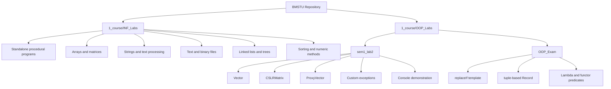
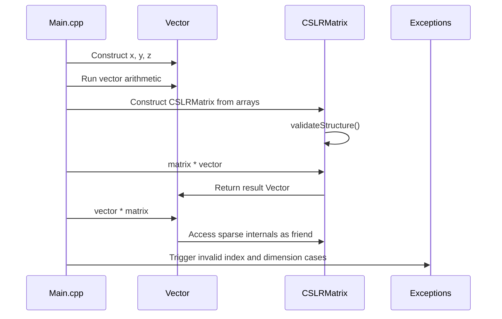
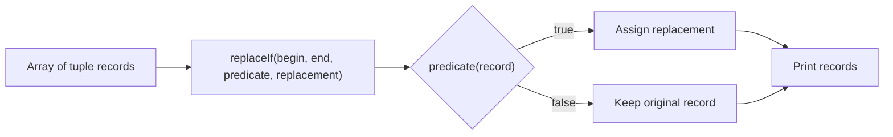

# BMSTU C/C++ Coursework Portfolio

> A structured first-year C/C++ coursework repository covering procedural programming, manual memory management, data structures, file processing, object-oriented design, operator overloading, sparse matrix representation, exceptions, templates, lambdas, and STL-style generic algorithms.

---

## Table of Contents

- [Executive Summary](#executive-summary)
- [Key Engineering Highlights](#key-engineering-highlights)
- [Technology Stack](#technology-stack)
- [System Architecture](#system-architecture)
- [Directory Structure](#directory-structure)
- [Core Components](#core-components)
- [Data Model](#data-model)
- [Application Flow](#application-flow)
- [Implemented Features](#implemented-features)
- [Engineering Decisions](#engineering-decisions)
- [Code Quality Assessment](#code-quality-assessment)
- [Build Status and Verification Notes](#build-status-and-verification-notes)
- [Scalability](#scalability)
- [Security Considerations](#security-considerations)
- [Performance Considerations](#performance-considerations)
- [Future Improvements](#future-improvements)
- [Portfolio Summary](#portfolio-summary)

---

## Executive Summary

This repository contains a collection of BMSTU first-year programming assignments implemented in C and C++. It is organized around two major learning tracks:

- **`INF_Labs`**: procedural programming exercises focused on algorithms, arrays, matrices, strings, files, linked lists, trees, sorting, numeric methods, and manual memory management.
- **`OOP_Labs`**: object-oriented C++ exercises focused on custom value types, sparse matrix/vector abstractions, operator overloading, exception handling, templates, lambdas, functors, and generic algorithms.

The most architecturally significant project is the OOP sparse matrix/vector lab. It implements a custom `Vector` type, a `CSLRMatrix` sparse matrix representation, domain-specific exceptions, arithmetic operators, stream operators, and validation of compressed sparse storage invariants.

This is an educational codebase rather than a production service. It does not include networking, databases, authentication, deployment infrastructure, or CI/CD. Its technical value comes from demonstrating C/C++ fundamentals, memory ownership, data representation, algorithmic thinking, and progressively more modular program structure.

---

## Key Engineering Highlights

- **Manual value semantics** for a dynamically allocated `Vector` type.
- **Compressed sparse matrix representation** using diagonal, lower-profile, upper-profile, row-pointer, and column-index arrays.
- **Operator overloading** for vector arithmetic, scalar multiplication, dot product, matrix-vector multiplication, vector-matrix multiplication, and stream I/O.
- **Domain-specific exceptions** for out-of-range access and incompatible dimensions.
- **Sparse matrix validation** for structural invariants such as pointer monotonicity and valid profile indices.
- **STL-style generic algorithm design** through a reusable `replaceIf` template.
- **Predicate abstraction** using both lambda functions and a stateful functor.
- **Broad procedural coverage** of arrays, matrices, files, strings, linked lists, binary trees, expression trees, sorting, and numeric methods.

---

## Technology Stack

| Area | Technology / Approach |
|---|---|
| Primary language | C++ |
| Procedural programming | C-style I/O, arrays, pointers, `FILE*`, `malloc/free` |
| Object-oriented programming | Classes, constructors, destructors, copy assignment, friend operators |
| Standard library | `<iostream>`, `<string>`, `<tuple>`, `<iterator>`, `<cmath>`, `<sstream>` |
| Error handling | Console validation in procedural labs, custom exceptions in OOP lab |
| Build tooling | Local `g++` commands, partial CMake configuration for `sem1_lab2` |
| Testing | Console-based manual verification in `main` functions |
| Database | Not present |
| Web/API layer | Not present |
| CI/CD | Not present |
| Deployment | Not present |

---

## System Architecture

The repository is a collection of independent console programs, not a single deployed application. Each lab or homework file represents one or more standalone assignments.



### Architectural Style

| Layer | Responsibility |
|---|---|
| Console entry points | Run each assignment through interactive input or printed demonstrations |
| Domain types | `Vector`, `CSLRMatrix`, `ProxyVector`, `Record` |
| Algorithm layer | Arithmetic operations, sparse traversal, sorting, searching, tree/list processing |
| Error handling | Input checks, console messages, and custom exceptions depending on assignment |
| Storage | In-memory arrays, linked structures, text files, and binary files |

---

## Directory Structure

```text
BMSTU/
├── README.md
├── .gitignore
├── 1_course/
│   ├── INF_Labs/
│   │   ├── Laboratory_2.cpp ... Laboratory_18.cpp
│   │   ├── HW_1.cpp ... HW_5.cpp
│   │   └── RK_4.cpp
│   └── OOP_Labs/
│       ├── OOP_Exam/
│       │   ├── main.cpp
│       │   ├── RecordPredicate.h
│       │   ├── RecordPredicate.cpp
│       │   ├── ReplaceIf.h
│       │   └── replace_if_exam.exe
│       └── sem1_lab2/
│           ├── README.md
│           └── sem1_lab2/
│               ├── CMakeLists.txt
│               ├── Main.cpp
│               ├── Vector.h / Vector.cpp
│               ├── Matrix.h / Matrix.cpp
│               ├── ProxyVector.h / ProxyVector.cpp
│               ├── Exceptions.h / Exceptions.cpp
│               └── lab2.exe
└── _git_backups_before_cleanup/
```

| Path | Responsibility |
|---|---|
| `1_course/INF_Labs` | Procedural programming labs and homework assignments |
| `1_course/OOP_Labs/sem1_lab2` | Object-oriented vector and sparse matrix lab |
| `1_course/OOP_Labs/OOP_Exam` | Generic algorithm and predicate-based replacement task |
| `_git_backups_before_cleanup` | Backup directory ignored by `.gitignore` |
| `*.exe` artifacts | Local compiled binaries; these should generally be excluded from source control |

---

## Core Components

### `Vector`

`Vector` is a custom dynamically allocated array of `double` values.

#### Responsibilities

- Owns and manages `double* m_data`.
- Tracks vector size through `std::size_t m_size`.
- Implements construction, copy construction, destruction, and copy assignment.
- Provides bounds-checked indexing through `operator[]`.
- Computes Euclidean vector length.
- Supports vector arithmetic and scalar multiplication.
- Supports dot product.
- Supports stream input and output.
- Participates in vector-matrix multiplication with `CSLRMatrix`.

#### Design Notes

The class intentionally demonstrates manual memory ownership and the Rule of Three. In production C++, `std::vector<double>` would be preferred, but the manual implementation is valuable in an educational context because it exposes allocation, copying, ownership, and destruction mechanics directly.

---

### `CSLRMatrix`

`CSLRMatrix` models a sparse square matrix using a compressed profile representation.

| Field | Purpose |
|---|---|
| `m_di` | Diagonal values |
| `m_al` | Lower-profile values |
| `m_au` | Upper-profile values |
| `m_iptr` | Row/profile pointer offsets |
| `m_jptr` | Column indices below the diagonal |
| `m_size` | Matrix dimension |
| `m_profileSize` | Number of stored profile entries |

#### Responsibilities

- Stores sparse matrix data in compressed form.
- Validates structural invariants of the sparse representation.
- Supports scalar multiplication.
- Supports matrix-vector multiplication.
- Supports vector-matrix multiplication through friend access.
- Provides logical element access through `at(row, col)`.
- Prints a dense matrix view through `operator<<`.
- Reads compressed matrix data through `operator>>`.

#### Structural Validation

The implementation verifies that:

- `iptr[0] == 0`
- `iptr[size] == profileSize`
- `iptr` is nondecreasing
- `jptr[k] < row`
- `jptr` values are strictly increasing inside each row

These checks are important because sparse matrix algorithms depend on the correctness of the compressed storage layout.

---

### `ProxyVector`

`ProxyVector` is a lightweight non-owning view over every `step`-th element of an existing `Vector`.

#### Responsibilities

- Stores a reference to an existing `Vector`.
- Validates that `step != 0`.
- Maps proxy indices to real vector indices through `index * step`.
- Throws `OutOfRangeException` when the mapped index is invalid.

This component demonstrates view-like behavior and indirect indexing without copying the underlying vector.

---

### Custom Exceptions

The OOP lab defines two domain exceptions:

| Exception | Purpose |
|---|---|
| `OutOfRangeException` | Invalid vector, proxy, or matrix index |
| `IncompatibleDimException` | Invalid dimensions or malformed sparse matrix structure |

Both inherit from `std::exception` and provide diagnostic messages through `what()`.

---

### `replaceIf`

`ReplaceIf.h` implements a small STL-style algorithm:

```cpp
template<typename Iter, typename UnaryPredicate, typename NewValue>
void replaceIf(Iter iterBeg, Iter iterEnd, UnaryPredicate predicate, const NewValue& newValue)
{
    for (; iterBeg != iterEnd; ++iterBeg) {
        if (predicate(*iterBeg)) {
            *iterBeg = newValue;
        }
    }
}
```

The design follows the common C++ iterator-range convention: `[begin, end)`.

---

### `RecordPredicate`

The exam project defines a tuple-based record:

```cpp
using Record = std::tuple<int, std::string, double>;
```

It also implements `ContainsStringFunctor`, a stateful predicate object that checks whether the second tuple field contains a configured substring.

---

## Data Model

### Vector Model

```text
Vector
├── m_size: std::size_t
└── m_data: double[m_size]
```

The vector stores contiguous numeric data and exposes algebraic operations over vectors of compatible size.

### Sparse Matrix Model

```text
CSLRMatrix
├── m_size
├── m_profileSize
├── m_di[m_size]
├── m_al[m_profileSize]
├── m_au[m_profileSize]
├── m_iptr[m_size + 1]
└── m_jptr[m_profileSize]
```

The diagonal is stored separately from lower and upper off-diagonal values. This supports sparse matrix-vector operations without allocating a dense `n x n` matrix.

### Exam Record Model

```text
Record = tuple<int, string, double>
```

Records are replaced when a predicate evaluates to `true`.

### Database Model

No database, ORM, schema migrations, or persistent application storage layer are present.

---

## Application Flow

### OOP Matrix Lab



### Exam Algorithm



### Procedural INF Labs

Most procedural assignments follow this execution model:

```text
Read input -> Process arrays/files/lists/trees -> Print result -> Release memory when allocated
```

---

## Implemented Features

### OOP Vector and Matrix Lab

- Dynamic vector construction, copying, assignment, and destruction.
- Bounds-checked vector indexing.
- Euclidean vector length calculation.
- Vector addition and subtraction.
- Unary vector sign operations.
- Scalar-vector and vector-scalar multiplication.
- Dot product.
- CSLR sparse matrix construction from raw arrays.
- Sparse matrix scalar multiplication.
- Matrix-vector multiplication.
- Vector-matrix multiplication.
- Dense formatted matrix output.
- Stream input/output for vectors and matrices.
- Domain exceptions for invalid access and incompatible dimensions.
- Proxy access to stepped vector elements.
- Console demonstration of normal operations and exception paths.

### OOP Exam Project

- Generic `replaceIf` algorithm over iterator ranges.
- Tuple-based records.
- Lambda predicate demonstration.
- Stateful functor predicate demonstration.
- Template-based record printing that preserves static array size.

### INF Lab Coverage

| Topic | Implemented Examples |
|---|---|
| Numeric methods | Series computation, integration, floating-point error analysis |
| Arrays | Sorting, filtering, duplicate removal, vector operations |
| Matrices | Static and dynamic matrix processing, row/column transformations, diagonal-region analysis |
| Strings | Word counting, tokenization, character classification, text transformation |
| Files | Text file processing, binary file generation, binary record management |
| Data structures | Singly linked lists, binary search trees, expression trees |
| Algorithms | Quick sort, search predicates, tree traversals, deletion algorithms |
| Memory management | `new/delete`, `malloc/free`, manual cleanup routines |

---

## Engineering Decisions

### Manual Memory Management as a Learning Tool

Many assignments intentionally use raw pointers and explicit allocation. This is appropriate for coursework because it exposes how ownership, copying, deallocation, pointer arithmetic, and memory safety issues work beneath higher-level abstractions.

### Sparse Matrix Representation

The CSLR matrix representation is the most significant data-modeling decision in the repository. It avoids dense storage for sparse matrices and reflects real numerical computing techniques where memory layout strongly affects performance.

### Algebraic Operator Overloading

The OOP lab uses operators to express mathematical operations naturally:

```cpp
Vector expr = (matrix * x) + (2.0 * y) - (-x);
```

This makes vector and matrix code closer to the underlying mathematical notation.

### Explicit Domain Validation

The OOP lab improves safety by throwing exceptions for invalid indices, incompatible dimensions, and malformed sparse matrix structures instead of silently producing undefined behavior.

---

## Code Quality Assessment

### Strengths

- The OOP lab is split into headers and implementation files.
- `Vector` avoids shallow-copy ownership bugs by defining copy construction, assignment, and destruction.
- Sparse matrix validation is explicit and catches malformed compressed structures early.
- Arithmetic operators are readable and map clearly to mathematical operations.
- Console demonstrations cover both successful paths and several error paths.
- The exam algorithm follows familiar STL iterator-range conventions.

### Limitations

- `CSLRMatrix` declares but does not define its copy constructor and destructor.
- `ProxyVector.cpp` is omitted from the current `sem1_lab2/CMakeLists.txt`.
- The local CMake file does not define a complete standalone CMake project.
- Several homework files contain multiple independent `main` functions in one `.cpp`, so they cannot compile as single translation units without splitting.
- Generated `.exe` files are committed.
- Some comments and the nested lab README appear to have encoding corruption.
- Manual memory management is inconsistent across the procedural labs.
- There is no automated test suite.
- There is no CI pipeline to detect compile regressions.

---

## Build Status and Verification Notes

The repository was reviewed as source code and lightly checked with local `g++`.

| Target | Observation |
|---|---|
| `sem1_lab2` syntax check with all implementation files | Passes syntax checking |
| `sem1_lab2` link with all implementation files | Fails because `CSLRMatrix` copy constructor and destructor are declared but not defined |
| `sem1_lab2` link using only files listed in `CMakeLists.txt` | Fails because `ProxyVector.cpp` is not included and `CSLRMatrix` definitions are missing |
| `OOP_Exam` syntax check | Fails because the lambda attempts to increment a captured `const int` |
| `Laboratory_18.cpp` compile check | Passes |

### Representative Manual Build Commands

```bash
g++ -std=c++17 -Wall -Wextra -Wpedantic \
    Main.cpp Vector.cpp Matrix.cpp Exceptions.cpp ProxyVector.cpp \
    -o lab2.exe
```

```bash
g++ -std=c++2b -Wall -Wextra -Wpedantic \
    main.cpp RecordPredicate.cpp \
    -o replace_if_exam.exe
```

These commands document the intended build model, but the source currently requires the fixes listed above before every target links successfully.

---

## Scalability

### What Scales Well

- CSLR sparse storage is more memory-efficient than dense matrix storage for sparse matrices.
- Matrix-vector multiplication iterates over stored profile entries rather than every matrix cell.
- `replaceIf` is generic and reusable across iterator-compatible containers.

### Bottlenecks

- Dense printing of sparse matrices is `O(n^2)` and unsuitable for large matrices.
- Manual memory management becomes more fragile as the codebase grows.
- Standalone procedural labs are not structured as reusable modules.
- Several programs use fixed-size buffers and C-style string processing.
- No automated build matrix exists for checking all assignments.

### Practical Scaling Improvements

- Replace owning raw arrays with `std::vector`.
- Add move construction and move assignment for large vector/matrix values.
- Split each standalone assignment into its own target.
- Add automated compile checks for every task.
- Avoid dense matrix output for large sparse matrices.

---

## Security Considerations

The repository does not implement authentication, authorization, networking, payments, or user accounts.

Relevant local-programming safety concerns are:

| Area | Assessment |
|---|---|
| Input validation | Present in some programs but inconsistent across the repository |
| Buffer safety | C-style strings and fixed buffers require careful bounds checking |
| Memory safety | Raw allocation introduces leak, double-free, and mismatched allocation risks |
| Secret management | No credentials or secrets are present |
| Binary files | Local binary files are read and written without schema validation |
| Exception safety | OOP lab improves diagnostics, but matrix stream extraction can leak temporary allocations if validation throws |

---

## Performance Considerations

- Vector arithmetic is linear in vector size.
- Dot product is `O(n)`.
- Matrix-vector multiplication is approximately `O(n + profileSize)`.
- Matrix element lookup scans row profile entries and is efficient when row profiles are small.
- Dense matrix output is expensive for large sparse matrices.
- Some procedural tasks intentionally use simple algorithms such as bubble sort.
- The quick sort implementation demonstrates recursive sorting and call counting.
- Binary search tree operations can degrade to linear time for already sorted input.

---

## Future Improvements

### Priority 1: Make Core Targets Buildable

- Define `CSLRMatrix::CSLRMatrix(const CSLRMatrix&)`.
- Define `CSLRMatrix::~CSLRMatrix()` and delegate cleanup to `free()`.
- Add `ProxyVector.cpp` to `sem1_lab2/CMakeLists.txt`.
- Add `cmake_minimum_required()` and `project()` to the CMake file.
- Fix the `OOP_Exam` lambda by removing the unreachable `a++`, making the captured value mutable and non-const, or moving mutation before `return`.

### Priority 2: Improve Repository Hygiene

- Remove committed `.exe` files.
- Extend `.gitignore` for generated binaries and build directories.
- Repair encoding in comments and nested documentation.
- Split multi-program homework files into separate source files or build targets.

### Priority 3: Add Verification

- Add automated compile checks for each standalone assignment.
- Add unit tests for `Vector`, `CSLRMatrix`, `ProxyVector`, and `replaceIf`.
- Add tests for invalid sparse matrix structures and incompatible dimensions.
- Add CI to run builds and tests on every commit.

### Priority 4: Modernize Selected Code

- Replace raw owning arrays with `std::vector`.
- Introduce RAII wrappers for file and memory ownership.
- Add move semantics for large value types.
- Replace fragile C-style string processing where the assignment allows it.

---

## Portfolio Summary

This repository demonstrates broad first-year C/C++ systems programming practice: numeric computation, procedural algorithms, files, strings, dynamic memory, linked structures, trees, templates, operator overloading, exceptions, and sparse matrix representation. The most mature engineering work is the OOP vector/matrix lab, which shows clear understanding of value types, ownership, arithmetic APIs, compressed data representation, and domain validation.

The repository would benefit significantly from build-system cleanup, automated tests, binary artifact removal, and a few missing definitions. Even with those limitations, it provides a technically meaningful foundation for discussing C++ fundamentals, data representation, algorithmic tradeoffs, and maintainability.
